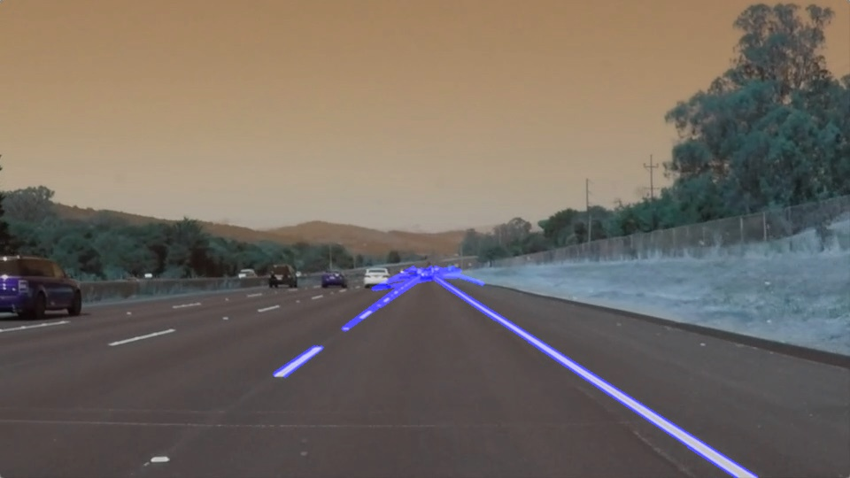

# **Finding Lane Lines on the Road** 
---

[//]: # (Image References)

[grayscale]:  ./images_writeup/grayscale_img.jpg "Grayscale"
[gaussian]:  ./images_writeup/gaussian_blur_img.jpg "Gaussian"
[canny]: ./images_writeup/canny_edges_img.jpg "canny"
[masked]: ./images_writeup/masked_img.jpg "masked"
[filterless_hough_transformed]: ./images_writeup/filterless_hough_transformed_img.jpg "filterless_hough_transformed"
[filterless_Lane]: ./images_writeup/filterless_Lane_img.jpg "filterless_Lane"
[all_lines]: ./images_writeup/all_lines_img.jpg "all_lines"
[left_lines]: ./images_writeup/left_lines_img.jpg "left_lines"
[left_filtered_lines]: ./images_writeup/left_filtered_lines_img.jpg "left_filtered_lines"
[right_lines]: ./images_writeup/right_lines_img.jpg "right_lines"
[right_filtered_lines]: ./images_writeup/right_filtered_lines_img.jpg "right_filtered_lines"
[left_extrapolated_line]: ./images_writeup/left_extrapolated_line_img.jpg "left_extrapolated_line"
[right_extrapolated_line]: ./images_writeup/right_extrapolated_line_img.jpg "right_extrapolated_line"
[both_lanes]: ./images_writeup/hough_transformed_img.jpg "both_lanes"

<!-- []: ./images_writeup/.jpg "" -->
---

### 1. Piepline Description

As described in the course, the pipeline consists of the following steps
* **Grayscale conversion:** Converting the RGB/BGR image to Grayscale.
* **Gaussian Blur:** Gaussian filter is applied to average out the noise if present
* **Canny Edges:** Canny edge filter is used to detect the rapid changes from between the adjacent pixels in a grayscale image to determine the edges. The resultant image contains dots indicating the sudden change of intensities(edges). 
* **Region of Interest (ROI):** As the camera is fixed on the car, lane lines will always appear in a fixed region of the image. This is the region of our interest and the other parts of the image can be masked to eliminate other edges which are not of our interest.
* **Hough Transform:** By applying Haugh Transform on the dots found from the resultant canny edge detection filter, lines are determined.
* **Drawing Lanes:** As a first step, all the detected lines are overlaid on the original image. 

| Grayscale Image | Gaussian Blur  | Canny Edges |
|:-:|:-:|:-:|
|  ![alt text][grayscale]  | ![alt text][gaussian]  | ![alt text][canny]  |
| **Masked Image (ROI)** | **Hough Transform result**  | **Detected lanes on the original image** |
|  ![alt text][masked] |  ![alt text][filterless_hough_transformed] | ![alt text][filterless_Lane]   |

<!--    -->

### 2. Modification of draw_lines() function.

Instead of modifying the available draw_lines() function, a new function draw_filtered_lines() is created. As the name infers, the lines determined from the Haugh transform are further filtered to determine the left and right lane which we are interested in.

draw_filtered_lines() function does the following tasks.

* **Grouping:** Grouping the lines from Haugh transform output into left and right lane groups.
  * This grouping is done based on the slope of the line. All the lines with negative slopes are grouped to left lane and those with positive to right lane.

|Hough Transform Output|Lines belonging to Left lane|Lines belonging to Right lane|
|:-:|:-:|:-:|
|![alt text][all_lines]|![alt text][left_lines]|![alt text][right_lines]|

* **Filtering:** After the lines are grouped, outliners are removed.
  * A line is marked as an outliner based on the respective z-score.
  * z-score is determined by calculating how much deviation is the current line's slope from the group's average.

| Grouped Left lane lines|Filtered Left lane lines|Grouped Right lane lines|Filtered Right lane lines|
|:-:|:-:|:-:|:-:|
|![alt text][left_lines]|![alt text][left_filtered_lines]|![alt text][right_lines]|![alt text][right_filtered_lines]|

* **Extrapolation:** From the filtered lines, a lane fit is estimated
  * First the line closes to the respective group's average slope is found.
  * The slope of the line found in the previous step is used to calculate the x-intercept at y = image-height.
  * Also x-coordinate at the group's minimum y-coordinate is calculated using the mentioned slope.
  * The calculated two points for the lane fix.

|Left Lane|Right Lane|Determined Lanes|
|:-:|:-:|:-:|
|![alt text][left_extrapolated_line]:|![alt text][right_extrapolated_line]:|![alt text][both_lanes]|

<b>Detected Lanes over layed on the raw image.<b/>

  

### 3. Potential shortcomings

* Parameters selected in the pipeline are valid for only a particular scenario. The environmental changes will effect the output as the parameters are static.
* The selection of Region of Interest
* The implemented pipeline works well for straight roads but not near turnings or curved roads, as we have only trying to fix straight lines.

### 4. Possible improvements

**Averaging the lines :**

* After grouping the lines into left and right lane groups, a lane line is selected based on the closeness to the average slope of the respective group.
* Instead averaging all the lines in the respective groups can give a better fix to the lane line.
* Also to determine more robust fix, weights can be assigned to each line in the group before averaging them.

**Removing Outliners**

* Currently outliners in a group of lines are determined based on simple z-score method. This can be improved by implementing more effective methods like Isolation Forest.